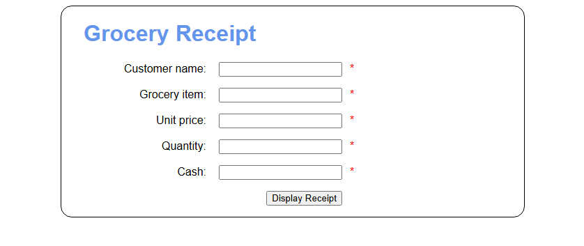
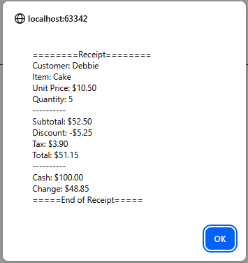

# **Simple-Checkout**
---
<!-- TODO: Capture a photo of this running for later and paste it in the assets folder with this name-->



## Programmers
<!-- We use &nbsp to add white space so Github links are aligned -->
* *Violet French       &nbsp;&nbsp;&nbsp;&nbsp;&nbsp;&nbsp;&nbsp;&nbsp;&nbsp;&nbsp;&nbsp;&nbsp;&nbsp;                      [GitHub](https://github.com/Pirategirl9000)*
* *Brayden Hermanson   &nbsp;&nbsp;                                                                                        [GitHub](https://github.com/brherm05)*

## Version
1.0

## Purpose
Displays a webpage that allows the user to input values that will then be turned into a grocery receipt summarizing the inputs and calculating the change they get back. Displays the output of the receipt in a Javascript alert message

## Functions
``` getElement(selector) ```
* Retrieves an element based on a CSS selector

``` calculateButtonClick(event) ```
* Gathers inputs from the HTML form and arranges them into a grocery receipt if the inputs are valid
* Attaches to the submit button of the form


---
### Credits
##### The code here is an adaptation of a script provided by *[Murach's Modern Javascript](https://www.murach.com/shop/murach-s-modern-javascript-detail)*
